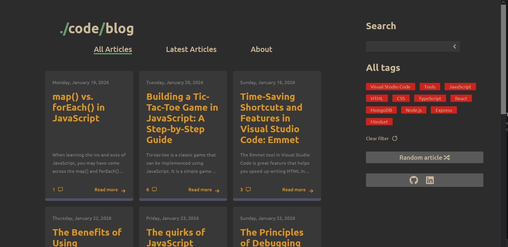
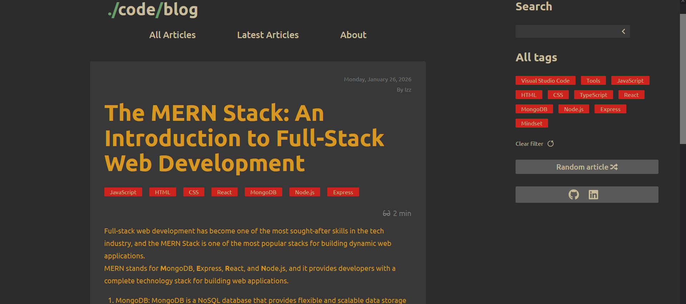
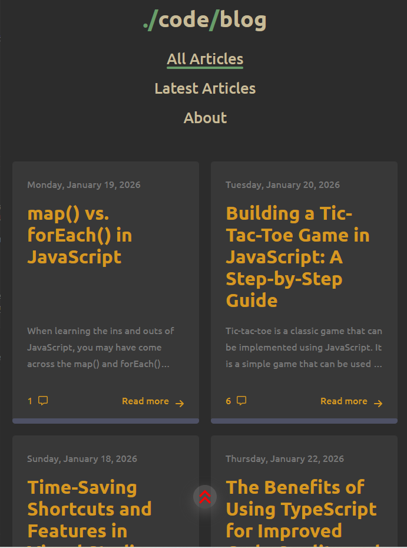
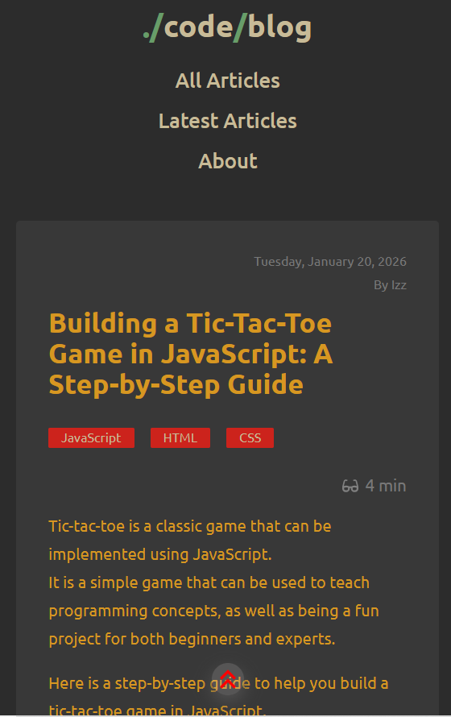
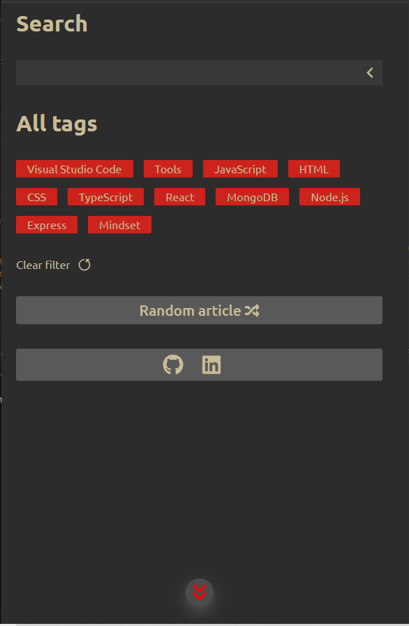
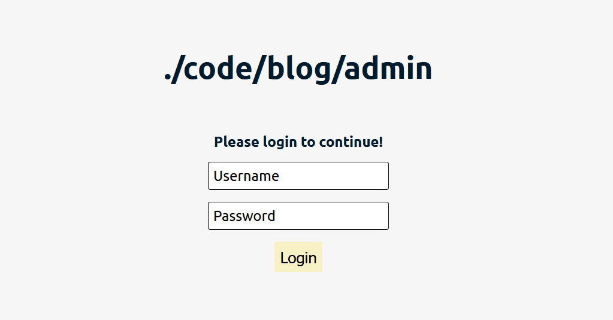

# Blog-API
---

A RESTful API that provides a convenient and secure way to access and manage your blog's data.

# Desktop

# Mobile

# Admin

## Features
---
    A simple and flexible API that makes it easy to interact with your blog's data.
    Support for CRUD (Create, Read, Update, Delete) operations for posts, comments, and other data.
    Authentication and authorization to ensure that only authorized users have access to your data.
    Robust error handling and validation to ensure that your data is accurate and secure.

## API
---
The blog client fetches data from a self-coded RESTful blog API. The source code for the API can be found at https://github.com/IzzAbdullah223/Blog-API/tree/main/Backend

## Client
---

The source code for the blog-client frontend can be found at https://github.com/IzzAbdullah223/Blog-API/tree/main/Frontend/User

## Admin
---

The source code for the blog-client frontend can be found at  https://github.com/IzzAbdullah223/Blog-API/tree/main/Frontend/Admin

## Endpoints
---
| Endpoint         | Method | Description                                      |
|-----------------|--------|--------------------------------------------------|
| /login           | POST   | Login as author/Admin                                |
| /Posts           | GET    | Retrieve a list of all articles for client and admin/Author board |
| /Posts/Tags      | GET    | Retrieve a list of all tags for client          |
| /Posts/random    | GET    | Retrieve a random article                        |
| /Posts/:PostId   | GET    | Retrieve a post by ID for client and admin board|
| /Posts/          | POST   | Create a new post as an admin/author            |
| /Posts/:PostId   | POST   | Comment on a post as a client                   |
| /Posts/:PostId   | PUT    | Update an existing post (publish, edit tags) as admin/Author |
| /Posts/:PostId   | DELETE | Delete a post as admin/Author                           |

  